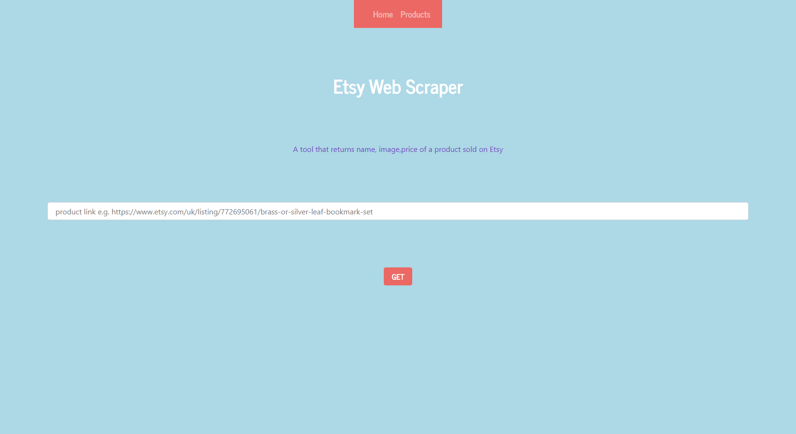
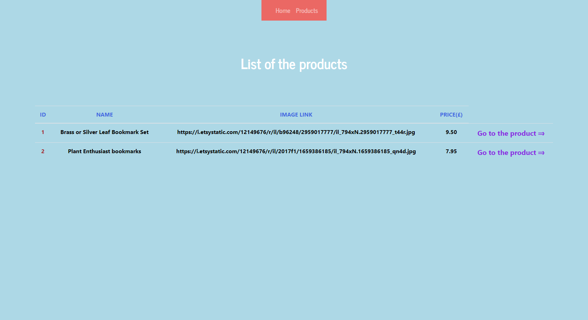
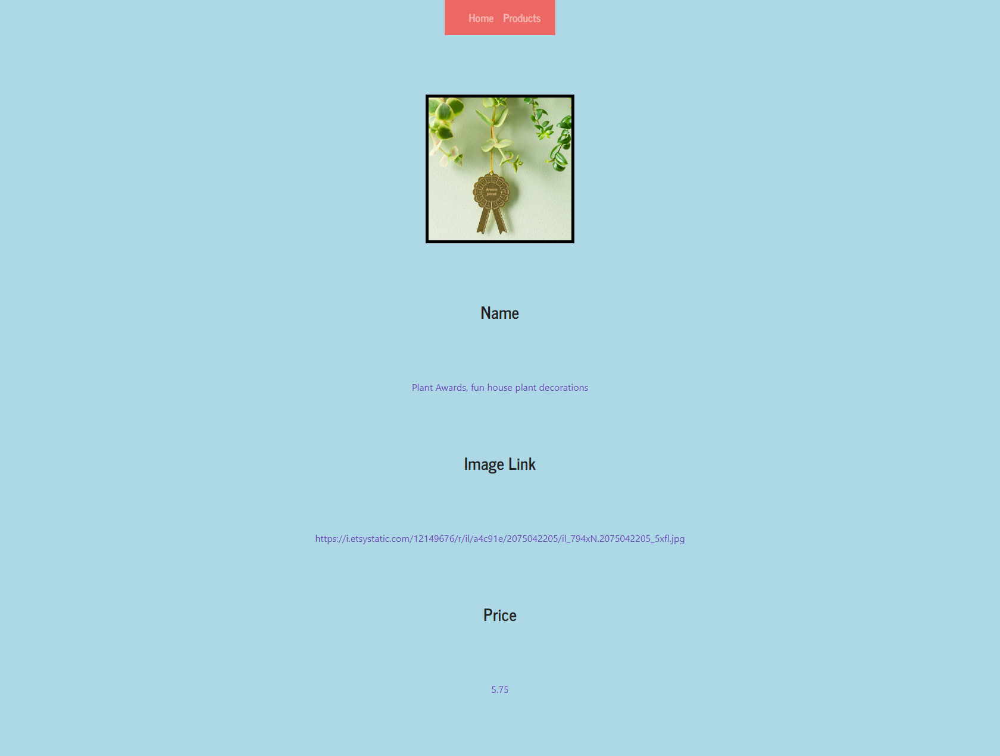
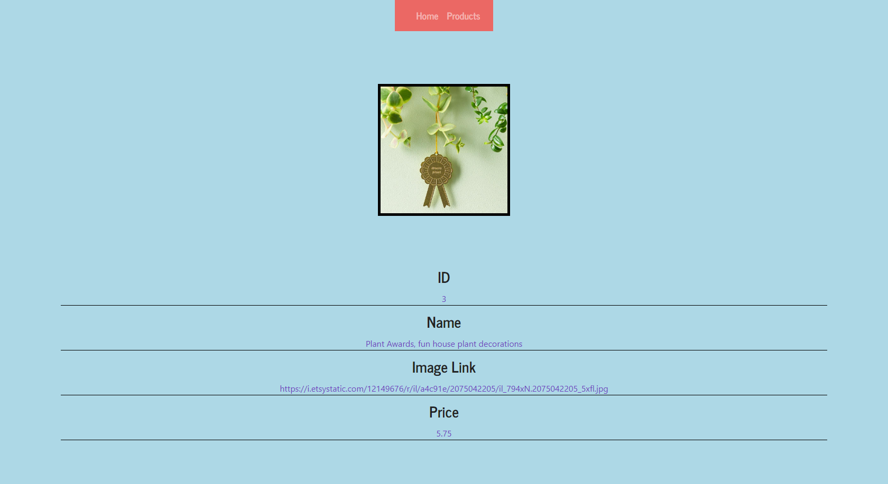
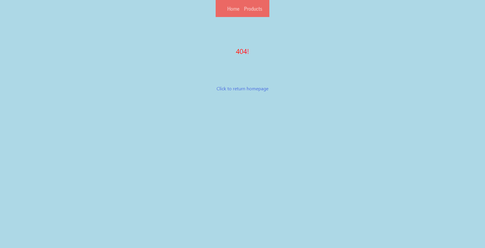

# Flask Web App

 Scraping a product from etsy.com using Flask Framework and MySQL as a database.

### <u>Requirements</u>

Python Flask Framework and MySQL.

Required packages are listed in the requirements.txt.

### <u>Screenshots</u>

##### home.html

##### products.html

After insertion of the product:

https://www.etsy.com/uk/listing/697038727/plant-awards-fun-house-plant-decorations?ref=home_more_from_this_shop-4

##### addedproduct.html

##### products.html

###### 

##### product.html

##### error.html

##### 

